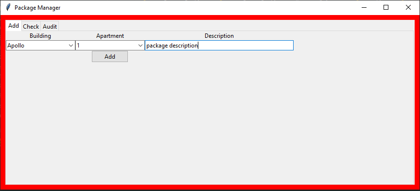
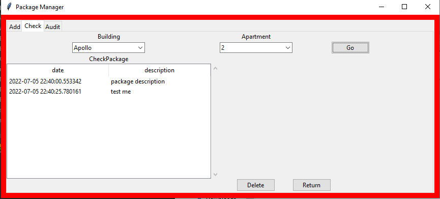
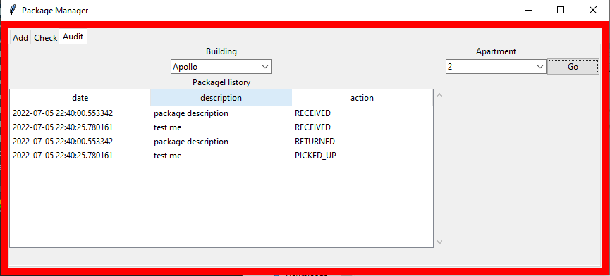

# Package Manager

This is a program that allows a receptionist to check in and out packages received for different buildings/apartments. 

Built in Python with a Tkinter GUI on top of a MySQL database it also supports an audit feature showing all actions taken on a package and notifies residents by email on every action. 

## Adding a package

## Checking existing packages

## Audit

